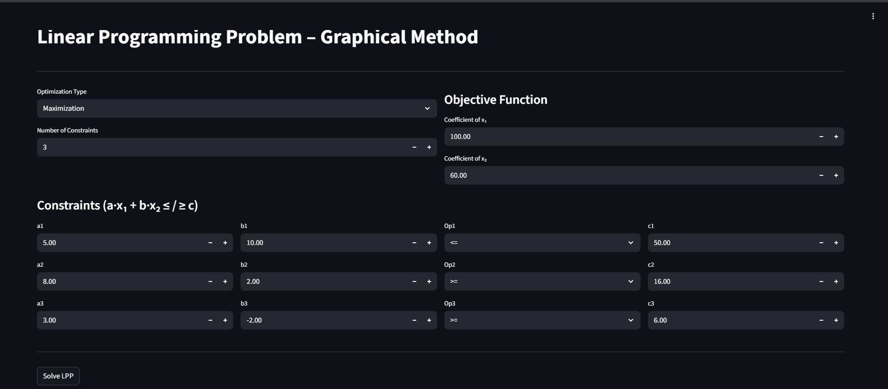
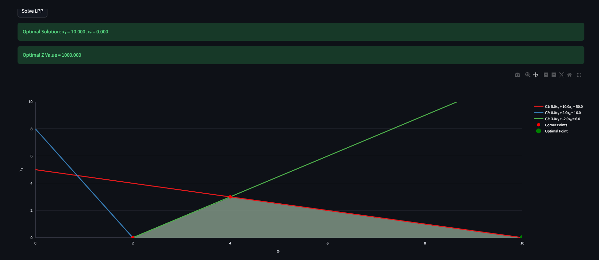

# Linear Programming Graphical Method – Web Visualizer

This project is a **web-based visualizer for Linear Programming Problems (LPP)** using the **graphical method**. It plots constraint lines, feasible regions, intersection points, and helps analyze optimal solutions visually.

The visualizations are built using **Plotly**, making them interactive and browser-friendly.

---

## 📁 Project Structure

```
project-folder/
│── app.py                 # Main Python script
│── requirements.txt       # Python dependencies
│── README.md              # Project documentation
```

---

## 🧾 requirements.txt

Create a file named **`requirements.txt`** and paste the following:

```
plotly
numpy
sympy
```

---

## ⚙️ Installation Guide (Step-by-Step)

### 1️⃣ Install Python

* Install **Python 3.8 or above**
* Download from: [https://www.python.org/downloads/](https://www.python.org/downloads/)
* During installation, **check** ☑️ *Add Python to PATH*

Verify installation:

```bash
python --version
```

or

```bash
python3 --version
```

---

### 2️⃣ Create Virtual Environment (Recommended)

```bash
python -m venv venv
```

Activate it:

**Windows**

```bash
venv\Scripts\activate
```

**Linux / macOS**

```bash
source venv/bin/activate
```

---

### 3️⃣ Install Dependencies

```bash
pip install -r requirements.txt
```

---

## ▶️ How to Run the Project

Run the Python file:

```bash
python app.py
```

OR

```bash
python3 app.py
```

If the script generates an HTML file (recommended):

```bash
open graph.html
```

or simply double-click the generated **`.html`** file in your browser.

---

## 📊 Features

* Interactive Plotly graphs
* Constraint line plotting
* Feasible region visualization
* Automatic intersection point calculation
* Objective function visualization
* Export graph as HTML

---

## 🧠 Example LPP Supported

```
Maximize: Z = 100x1 + 60x2

Subject to:
5x1 + 10x2 ≤ 50
8x1 + 2x2 ≥ 16
3x1 - 2x2 ≥ 6
x1, x2 ≥ 0
```
**Output**:

i) Input

ii) Graph:

---

## 🛠️ Technologies Used

* Python
* Plotly (`plotly.graph_objects`)
* NumPy
* SymPy

---

## ❗ Common Errors & Fixes

### Plotly not found

```bash
pip install plotly
```

### pip not recognized

```bash
python -m ensurepip --upgrade
```

---

## 📌 Notes

* Best viewed on desktop browsers
* Works offline once HTML is generated
* Suitable for engineering mathematics & OR labs

---

## 👤 Author

**Pranay Nampally**
Undergraduate Student

---

## 📄 License

This project is for **educational purposes only**.

---
